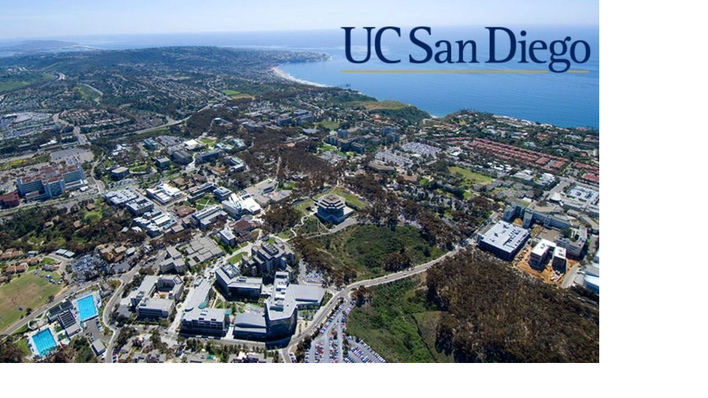

## David Jun
### UC San Diego 2023

I am a student at UCSD, which is pictured below.

Here's a picture of the library.

I am a part of Earl Warren College, which has the motto:
> Toward a life in balance

I like a few sports:
- ~~volleyball~~
- **soccer**
- basketball

The first line of code I learned is `print('Hello World')`.

I am styling this page with [GitHub Flavored Markdown](https://docs.github.com/en/github/writing-on-github/getting-started-with-writing-and-formatting-on-github/basic-writing-and-formatting-syntax).

Java is my favorite programming language. 

In order, these are my favorite programming lanugages:
1. Java
2. C++
3. Python

Courses I need to take:
- [x] CSE 100
- [ ] CSE 110
- [ ] CSE 101
